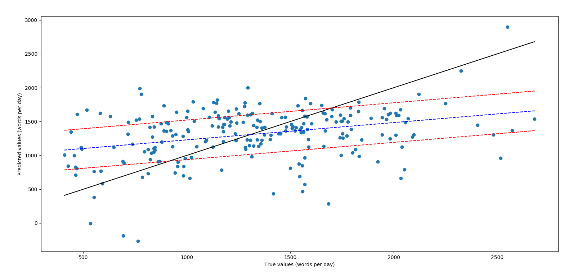
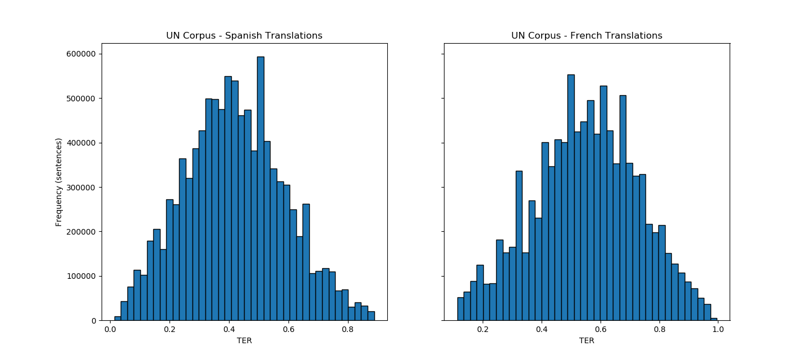
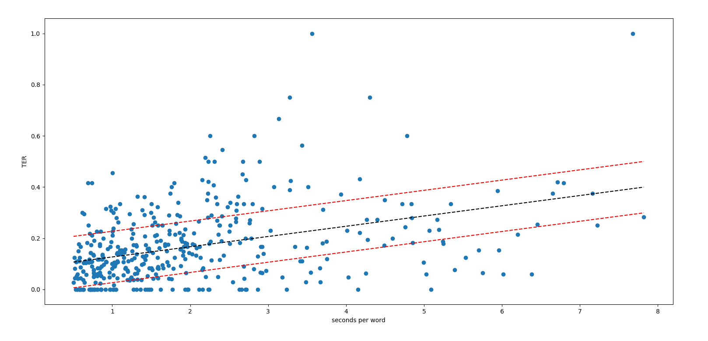
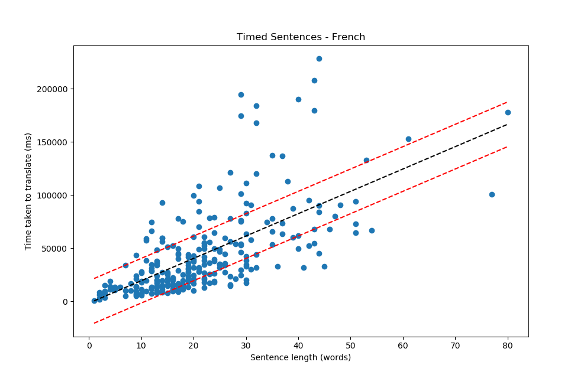

# Translation Difficulty Estimation

With increasing globalisation and the push towards automation, it becomes essential to improve the current translation workflows. In this project, the United Nations corpus is explored in order to understand the factors contributing to difficulties in both human and machine translation. The time taken for human translation of documents is predicted, as well as classification of sentences based on their predicted machine translation usefulness. This is achieved using a combination of lexical features, translation edit rate and sentence vectorisation through Facebook's XLM neural networks.

See the [case study](docs/trdiff-case_study.pdf) for a one-page summary of the work conducted in this project. 

## Table of contents
- **1.** [Initial Ideas](#initial-ideas)     
- **2.** [Introduction](#introduction)     
- **3.** [Biber Dimensions](#biber-dimensions-\--words-per-day)    
    + **3.1** [Regression](#regression-\--translation-rate)  
    + **3.2** [Classification](#classification-\--translation-difficulty)         
- **4.** [Translation Edit Rate](#translation-edit-rate)
    + **4.1** [Connecting TER and Words per Day](#connecting-ter-and-words-per-day)    
- **5.** [Timed Sentences](#timed-sentences)      
- **6.** [Text Data Pre-Training](#text-data-pre\-training)
    + **6.1** [Sentence Embeddings with XLM](#sentence-embeddings-with-XLM)    
- **7.** [Semi-Supervised Regression](#semi\-supervised-regression)       

### Initial Ideas:

- Linear regression using Biber dimensions (predicting words per day):
  + UN texts  
  + WTO texts 
- Prediction of MT errors and it's relation to text difficulty - domain adaptation
  + Predict TER using Biber dimensions
  + Predict TER using XLM pretraining
  + Build models and test on timed UN data to predict words per day
- Test QEBrain - MT errors without reference
- Semi-supervised approaches and NN: 
  + Curriculum learning - X. Zuang et al. 2018, "An Empirical Exploration of Curriculum Learning for Neural Machine Translation" 
  + denoising MT - W. Wang et al. 2018, "Denoising Neural Machine Translation Training with Trusted Data and Online Data Selection"
  + Bidirectional Language Model (biLM) - M. E. Peters et al 2018, "Deep contextualized word representations" 
  + Y. Yang et al 2019, "Improving Multilingual Sentence Embedding using Bi-directional Dual Encoder with Additive Margin Softmax"
  + K. Fan et al 2018, "Bilingial Expert Can Find Translation Errors"
  + D. Yogotama et al 2019, "Learning and Evaluating General Linguistic Intelligence"
  + G. Kostopoulos et al 2018, "Semi-Supervised Regression: A recent review"
- Visualisation of multidimensional data

Top scores for 3-class predictions:

| Classification accuracy (3-class) | words per day | TER |
|-----------------------------------|---------------|-----|
| Biber dim                         |           48% | 40% |
| XLM embeddings                    |           wip | 54% |

*Note: Words translated per day are only available for around 300 documents, score shown is accuracy obtained by a k-neighbours classifier (number of neighbours = 4). TER can be computed for any number of sentences, in this case results are shown for SVM on 200,000 sentences. For comparison, random classification yields a score around 33%, as expected. All results shown for French translations; Spanish offer similar results and in most cases marginally better scores. 

Can also split data into 2 classes, good and bad translations (or easy and difficult) for which an accuracy of 70% is obtained on 200,000 sentences for the XLM-TER case.

See the [results](results/) folder for each experiment output.    
Classifiers in experiments output f1-score, precision and recall for each label.   
Regression models produce r2-score, MSE and QQ plots of residuals.

## Introduction
As one would expect, the time it takes to translate a document is roughly proportional to the number of words it contains (see figure 1). Nonetheless, there is great variance between documents. If time taken was only dependent on the length of a document, the rate of translation (words per day) would be a constant. In the case of the tested UN corpus this would be approximately 1429 words per day. However, as we can see in figure 2, there is a large distribution of translation rates across the documents (standard deviation of 484 words per day). Therefore, there must be other variables causing such differences. 

     
**Figure 1.** Time it took to translate a document against the length of the document in words for a set of around 300 United Nations public documents.

As the number and length of documents increases, it would be advantageous to determine what other factors contribute to the translation time and ultimately understand what makes a text hard to translate. This could also influence machine translation (MT) and give insight into the factors that negatively impact the quality of MT. A solid understanding of translation difficulty might lead to changes in the way MT algorithms are taught or even the way documents are written.   

        
**Figure 2.** Distribution of translation rate (words per day) for a set of around 300 United Nations public documents.    

Documents can be split into categories depending on things such as the topic of the text. In the case of the labeled UN corpus, documents can be split according to the department or committee that emitted the document. These categories may exhibit different behaviours and offer further insight into the varience in translation rate. An example of this is shown in figure 3, where the average translation rate of each category is displayed along with standard deviations.

        
**Figure 3.** Average translation rate and standard deviation for each category (UN council) in a set of around 300 United Nations public documents.

The UN dataset can be accesed using wget or similar:

```bash
$ wget -O $2 'https://daccess-ods.un.org/access.nsf/GetFile?Open&DS='$1'&Lang=E&Type=DOC'
```
where $1 is the document code and $2 is the desired output name. Translations can be obtained by replacing Lang=E with Lang=F or Lang=S, for French and Spanish respectively.

For more information on the UN Parallel Corpus read the [paper](https://www.aclweb.org/anthology/L16-1561) by M. Ziemski et al. 

## Biber Dimensions - words per day

Biber dimensions (lexical, syntactic, tex-level... features in texts) can be used to build regression models predicting the rate of translation of documents (in words per day).

See [biberpy](https://github.com/ssharoff/biberpy) for extraction of Biber dimensions in `python`. 

The UNOG (around 300 documents) and WTO (around 100 documents) datasets contain metadata including time taken to translate each document. 

### Regression - translation rate
Preliminary results using ordinary least squares regression show a weak correlation between biber dimensions and words translated per day. However, there is still large error in the predicted values and the residuals are not completly random error. This could be due to uncertainty in the data itself and other factors affecting the rate of translation that havent been accounted for. The results can be improved slightly by using the total number of words in the document and the category or topic of the document (e.g. which department of the UN) up to an r2-score = 0.43. Using other linear regression methods such as Ridge Regression and Lasso Regression offer very similar results.  

    
**Figure 4.** Predicted against real values of words translated per day for the UNOG dataset (using biber dimensions and number of words in each document).

    
**Figure 5.** Difference in predicted and real values for the UNOG dataset. Note the appearance of a trend, possibly due to a systematic error or the increased uncertainty in documents that took to long (external reasons) or too short (lowest timeframe visible is one day).

WTO data has the advantage of including translation times to both French and Spanish, however, results with this dataset seem significantly worse. The uncertainty in the time is easier to spot in this dataset, with unusually large differences in time taken for one language compared to the other when translating the same document. The UNOG and WTO datasets can be combined. This results in greater error, possibly due to inherent differences in the datasets or because the WTO has more uncertainty. On the other hand, combining datasets might provide a more generalised model and avoid overfitting to one corpus. 

It is interesting to note that if outliers are not removed from the combined dataset, the regression becomes quite accurate in the range 0-2500 words per day, however, it also produces significant outliers that throw the entire model off. Could be interesting to only use the model in this range and figure out what produces said outliers (several orders of magnitude wrong).

    
**Figure 6.** Predicted against real values of words translated per day for the UNOG dataset (using biber dimensions and number of words in each document). Cross-validated results with 12 equal splits of data.

Note: before extracting Biber dimensions, it is important to make sure there is one text per line and that there are no empty lines as this will cause _biber-dim.py_ to fail. Each corpus may have it's particular solutions. For example:

```bash
$ sed '/^[[:space:]]*$/d' # remove empty lines (only spaces or tabs).
```

### Classification - translation difficulty
Trying to predict the exact time taken to translate a text comes with a lot of uncertainty. The main aim of this work is to describe the factors that influence how hard texts are to translate. In order to gain a better understanding of difficulty, texts can be divided according to the rate of translation. For example, texts could be classified as easy, average or difficult depending on how fast they are translated (in words per day) in comparison with the rest of the corpus.

The labeled UN corpus can be divided into the aforementioned classes. After removal of the top and bottom 5% of values, there are 203 documents. The fastest 67 are considered easy to translate, the slowest 67 difficult to translate and the remaining 69 as average. The data can also be split into more classes, using four quartiles for example. 

These method may have increased uncertainty caused by documents that were recorded as taking 1 day to translate, as it is likely that each document took a different amount of hours. This means translation rates appear to be smaller for shorter documents thus might be incorrectly labeled as _difficult_. 

## Translation Edit Rate
"Translation Edit Rate (TER) measures the amount of editing that a human would have to perform to change a sytem output so it exactly matches a reference translation" See "A Study of Translation Edit Rate with Targeted Human Annotation", M. Snover et al. 2006, for more details.

Computing the TER on a machine translation gives a score based on the minimum number of edits needed to correct the tranlation, where a score of 0 would be a perfect translation and 1 would mean the number of edits needed is equal to the number of reference words in the human translation. The score is related to difficulty of translation for a machine, which could hypothetically be correlated to difficulty for human translation. Therefore, TER could be a further source to determine text difficulty. 

Note that in order to compute TER, both a machine translation and a human reference are required. See the [pre-processing](scripts/prepare_ter_docs.py) needed to compute TER for the UN corpus as an example. 

      
**Figure 7.** Distribution of translation edit rate for machine translated sentences with human reference for UN documents after removal of top and bottom 5% of TER scores. Original documents in English translated to Spanish (left) and French (right).

It could be interesting to relate TER score with the Biber dimensions of the original text, to determine if any of these factors makes machine translation harder. 
Preliminary results show no correlation between TER and biber dimensions on a sentence level - OLS and SVR on large UN corpus. There is inherent difficulty in this as Biber dimensions are designed to work on a document level whilst TER works best on a sentence level. 

### Connecting TER and words per day
TER and words translated per day are both measures of how difficult a text is to translate. However, TER is a measure of the difficulty for machine translation whilst words per day plays a similar role for human translation. We can assume these two are connected to a certain extent such that if a factor causes machine translation to be harder, it is likely to also contribute to a slower human translation. 

It is challenging to connect TER and words per day because the former is computed on a sentence basis whilst the latter tends to be quoted per document. Another problem is that, whilst TER can be computed on any text with a human reference, there is a lack of open access information on time taken to translate. To showcase the usefulness of timed data, a set of around 400 sentences were translated and the time spent was recorded for each sentence (figure 9). This removes much of the uncertainty present in documents. In the case of the translator and sentences used, a correlation of 0.41 was found between the average time spent translating each word and the TER score of the sentence's machine translation (see figure 8). This is just an indication of the correlation as the data available is limited, however, it shows that machine translation and human translation have some commonalities, albeit far from a one-to-one link.   

      
**Figure 8.** Correlation of TER of machine translated sentences versus average time spent translating each word for human translation of the same sentences. This correlation hints to the existence of common factors in what makes translation difficult for MT and HT, however, both methods are quite different and are better treated as two seperate problems.  

## Timed Sentences
As both TER and XLM work on a sentence level, it is important to explore the difficulty to translate sentences. Figure 8 shows the correlation between the rate at which sentences were translated and the TER for the same sentences. Figure 9 displays the near-linear relationship between sentence length and time taken to translate, similar to that obtained on a document level in figure 1. 

      
**Figure 9.** Time taken to translate a sentence against the number of words in the sentence. Linear relationship, as expected, but there is a large spread, especially for longer sentences. Original sentences in English translated to French.

## Text Data Pre-Training
See [XLM](https://github.com/facebookresearch/XLM) for PyTorch original implementation of Cross-lingual Language Model Pretraining.     
See [ELMo](https://github.com/allenai/allennlp/blob/master/tutorials/how_to/elmo.md) for PyTorch/TensorFlow implementation of Deep contextualized word representations.      
See [BERT](https://github.com/google-research/bert) for a method of pre-training language representations in TensorFlow.     

Also interesting to check out [huggingface](https://github.com/huggingface/pytorch-transformers)'s PyTorch-Transformers library of pre-trained models for NLP.    
A simple way to obtain sentence embeddings from BERT pre-trained models is to use [bert-as-service](https://github.com/hanxiao/bert-as-service).

Dealing with unlabeled texts can be complex, however, by performing pre-training vectorisation of text data results can be significantly improved. The idea is to produce sentence embedding vectors which can be used for training. Once unlabelled text data is vectorised, it can be used to predict TER, translation rate etc. and ultimately text difficulty.

### Sentence embeddings with XLM

In order to vectorise texts, a few steps must be followed to prepare data. Firstly, the prefered pre-trained model, BPE codes and vocabulary are obtained from [XLM](https://github.com/facebookresearch/XLM#pretrained-models). In our case we are dealing with translation to different languages so the XNLI-15 model is used (pretrained on masked language modelling and translation language modelling). The texts must be split into sentences before processing. Some texts contain a large amount of digits and serial numbers which are not translated, thus these can de removed before vectorisation. The sentences can then be forced to lower case. For example:

```bash
$ sed 's/\S*[0-9]\S*//g' input_file | tr '[:upper:]' '[:lower:]' > output_file
```

The next step is to apply the previously obtained BPE codes to the sentences. This can be done by using the python API or by cloning the fastBPE repo and using the following command:

```bash
$ ./fast applybpe output_file input_file bpe_codes
```

Note: fastBPE must be compiled before running. See [fastBPE](https://github.com/glample/fastBPE) for help.

Once the sentences have been prepared, the XLM model can be [applied](scripts/XLM_generate_embeddings.py) to produce tensors of shape (sequence_length, batch_size, model_dimension). When using XLM the first hidden state of the last layer is used as input for classification tasks as recommended in the XLM repository. This corresponds to tensor[0] in python. Generating sentence embeddings is quite computer intensive so the use of GPUs is advised. For example, the limit of sentences that can be processed at the same time is around 500 for a 128GB CPU, however, the run time is relatively low (around 30 minutes) so the text can be run quite quickly in parallel.   

## Semi-Supervised Regression
Due to the limit in labeled data (currently have access to ~300 documents) and the easier access to unlabeled data, semi-supervised regression is a good candidate for improved regression models.

The general idea is to use labeled data to predict unlabeled data, accept the results above a confidence threshold, using these new labels to predict the remaining unlabeled data and so on and so forth. For example, the labeled UNOG dataset could be combined with the larger unlabeled UN corpus to predict the words translated per day, ultimately linked with text difficulty. Similarly, the translation edit rate could be predicted.
