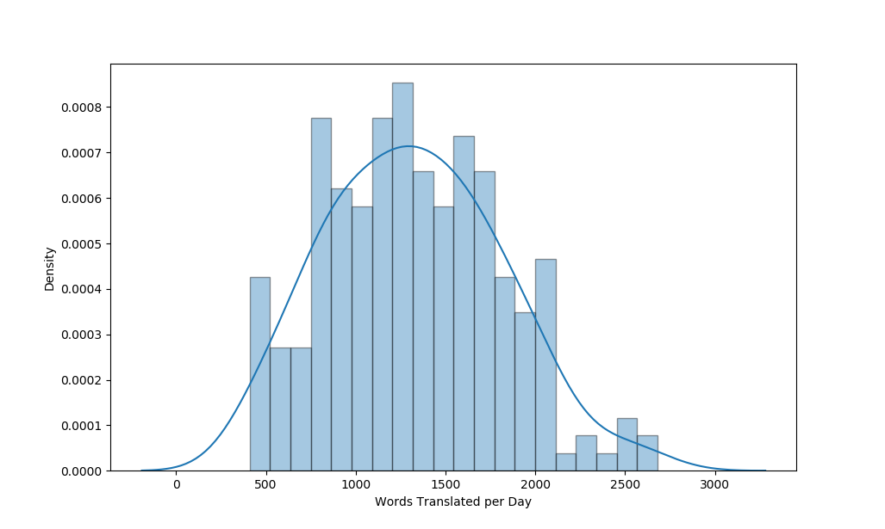

# trdiff

The overall objective is to understand what makes a text difficult to translate.  
Can we predict which text are easier/harder to translate? (for human translation or machine translation)       
Can we modify or improve existing methods?      
Improve NLP methods by making alterations to input texts or by selecting how and when new examples are taught to the algorithm.      
Need models that can predict TER on a sentence level and words per day on a document level. Both in either regression or classification tasks.

## Table of contents
- **1.** [Work In Progress](#work-in-progress)    
- **2.** [Initial Ideas](#initial-ideas)     
- **3.** [Introduction](#introduction)     
- **4.** [Biber Dimensions](#biber-dimensions-\--words-per-day)    
    + **4.1** [Regression](#regression-\--translation-rate)  
    + **4.2** [Classification](#classification-\--translation-difficulty)         
- **5.** [Translation Edit Rate](#translation-edit-rate)    
- **6.** [Text Data Pre-Training](#text-data-pre\-training)    
- **7.** [Semi-Supervised Regression](#semi\-supervised-regression)
  
### Work in progress:

- **1.** Correlation between Biber-dim and time taken to translate:    
    + UN-timed [done]
        * regression [done]
        * classification [wip]    
    + WTO-timed [done]    
- **2.** Correlation between Biber-dim and TER score:    
    + UN-parallel (at sentence and document level)
        * regression [sentence done]
        * classification [sentece wip]
    + cross-validation    
- **3.** Use XLM to vectorise texts and correlate with TER score 
    + regression 
    + classification [wip]
- **4.** Use TER score to predict time taken or classify text difficulty    
    + Build classifiers + cross-validation 

### Initial Ideas:

- Linear regression using Biber dimensions (predicting words per day):
  + UN texts  
  + WTO texts 
- Prediction of MT errors and it's relation to text difficulty - domain adaptation
  + Predict TER using Biber dimensions
  + Predict TER using XLM pretraining
  + Build models and test on timed UN data to predict words per day
- Test QEBrain - MT errors without reference
- Semi-supervised approaches and NN: [Relatively new field - can learn basic NN and try some of these]
  + Curriculum learning - X. Zuang et al. 2018, "An Empirical Exploration of Curriculum Learning for Neural Machine Translation" 
  + denoising MT - W. Wang et al. 2018, "Denoising Neural Machine Translation Training with Trusted Data and Online Data Selection"
  + Bidirectional Language Model (biLM) - M. E. Peters et al 2018, "Deep contextualized word representations" 
  + Y. Yang et al 2019, "Improving Multilingual Sentence Embedding using Bi-directional Dual Encoder with Additive Margin Softmax"
  + K. Fan et al 2018, "Bilingial Expert Can Find Translation Errors"
  + D. Yogotama et al 2019, "Learning and Evaluating General Linguistic Intelligence"
  + G. Kostopoulos et al 2018, "Semi-Supervised Regression: A recent review"
- Visualisation of multidimensional data [Basic knowledge of this - would be interesting to see what we can do]   

## Introduction
As one would expect, the time it takes to translate a document is roughly proportional to the number of words it contains (see figure 1). Nonetheless, there is great variance between documents. If time taken was only dependent on the length of a document, the rate of translation (words per day) would be a constant. In the case of the tested UN corpus this would be approximately 1429 words per day. However, as we can see in figure 2, there is a large distribution of translation rates across the documents (standard deviation of 484 words per day). Therefore, there must be other variables causing such differences. 

     
**Figure 1.** Time it took to translate a document against the length of the document in words for a set of around 200 United Nations public documents.

As the number and length of documents increases, it would be advantageous to determine what other factors contribute to the translation time and ultimately understand what makes a text hard to translate. This could also influence machine translation (MT) and give insight into the factors that negatively impact the quality of MT. A solid understanding of translation difficulty might lead to changes in the way MT algorithms are taught or even the way documents are written.   

        
**Figure 2.** Distribution of translation rate (words per day) for a set of around 200 United Nations public documents.    

Documents can be split into categories depending on things such as the topic of the text. In the case of the labeled UN corpus, documents can be split according to the department or committee that emitted the document. These categories may exhibit different behaviours and offer further insight into the varience in translation rate. An example of this is shown in figure 3, where the average translation rate of each category is displayed along with standard deviations.

        
**Figure 3.** Average translation rate and standard deviation for each category (UN council) in a set of around 200 United Nations public documents.

## Biber Dimensions - words per day

Biber dimensions (lexical, syntactic, tex-level... features in texts) can be used to build regression models predicting the rate of translation of documents (in words per day).

See [biberpy](https://github.com/ssharoff/biberpy) for extraction of Biber dimensions in `python`. 

The UNOG (around 200 documents) and WTO (around 100 documents) datasets contain metadata including time taken to translate each document. 

### Regression - translation rate
Preliminary results using ordinary least squares regression show a weak correlation between biber dimensions and words translated per day. However, there is still large error in the predicted values and the residuals are not completly random error. This could be due to uncertainty in the data itself and other factors affecting the rate of translation that havent been accounted for. The results can be improved slightly by using the total number of words in the document and the category or topic of the document (e.g. which department of the UN) up to an r2-score = 0.43. Using other linear regression methods such as Ridge Regression and Lasso Regression offer very similar results.  

    
**Figure 4.** Predicted against real values of words translated per day for the UNOG dataset (using biber dimensions and number of words in each document).

    
**Figure 5.** Difference in predicted and real values for the UNOG dataset. Note the appearance of a trend, possibly due to a systematic error or the increased uncertainty in documents that took to long (external reasons) or too short (lowest timeframe visible is one day).

WTO data has the advantage of including translation times to both French and Spanish, however, results with this dataset seem significantly worse. The uncertainty in the time is easier to spot in this dataset, with unusually large differences in time taken for one language comapred to the other when translating the same document. The UNOG and WTO datasets can be combined. This results in greater error, possibly due to inherent differences in the datasets or because the WTO has more uncertainty. On the other hand, combining datasets might provide a more generalised model and avoid overfitting to one corpus. 

It is interesting to note that if outliers are not removed from the combined dataset, the regression becomes quite accurate in the range 0-2500 words per day, however, it also produces significant outliers that throw the entire model off. Could be interesting to only use the model in this range and figure out what produces said outliers (several orders of magnitude wrong).

Note: before extracting Biber dimensions, it is important to make sure there is one text per line and that there are no empty lines as this will cause biber-dim.py to fail. Each corpus may have it's particular solutions. For example:

```bash
$ sed '/^[[:space:]]*$/d' # remove empty lines (only spaces or tabs).
```

### Classification - translation difficulty
Trying to predict the exact time taken to translate a text comes with a lot of uncertainty. The main aim of this work is to describe the factors that influence how hard texts are to translate. In order to gain a better understanding of difficulty, texts can be divided according to the rate of translation. For example, texts could be classified as easy, average or difficult depending on how fast they are translated (in words per day) in comparison with the rest of the corpus.

The labeled UN corpus can be divided into the aforementioned classes. After removal of the top and bottom 5% of values, there are 203 documents. The fastest 67 are considered easy to translate, the slowest 67 difficult to translate and the remaining 69 as average. The data can also be split into more classes, using four quartiles for example. 

These method may have increased uncertainty caused by documents that were recorded as taking 1 day to translate, as it is likely that each document took a different amount of hours. This means translation rates appear to be smaller for shorter documents thus might be incorrectly labeled as _difficult_. 

## Translation Edit Rate
"Translation Edit Rate (TER) measures the amount of editing that a human would have to perform to change a sytem output so it exactly matches a reference translation" See "A Study of Translation Edit Rate with Targeted Human Annotation", M. Snover et al. 2006, for more details.

Computing the TER on a machine translation gives a score based on the minimum number of edits needed to correct the tranlation. This is related to difficulty of translation for a machine, which could hypothetically be correlated to difficulty for human translation. Therefore, TER could be a further source to determine text difficulty. 

Note that in order to compute TER, both a machine translation and a human reference are required. See the [pre-processing](scripts/prepare_ter_docs.py) needed to compute TER for the UN corpus as an example. 

It could be interesting to relate TER score with the Biber dimensions of the original text, to determine if any of these factors makes machine translation harder. 
Preliminary results show no correlation between TER and biber dimensions on a sentence level - OLS and SVR on large UN corpus. There is inherent difficulty in this as Biber dimensions are designed to work on a document level whilst TER works best on a sentence level. 

## Text Data Pre-Training
See [XLM](https://github.com/facebookresearch/XLM) for PyTorch original implementation of Cross-lingual Language Model Pretraining.     
See [ELMo](https://github.com/allenai/allennlp/blob/master/tutorials/how_to/elmo.md) for PyTorch/TensorFlow implementation of Deep contextualized word representations.      
See [BERT](https://github.com/google-research/bert) for a method of pre-training language representations in TensorFlow.     

The idea is to produce sentence embedding vectors which can be used for training. Once unlabelled text data is vectorised, it can be used to predict TER. Once a model is constructed, this can be used to predict words translated per day and ultimately text difficulty.

## Semi-Supervised Regression
Due to the limit in labeled data (currently have access to ~300 documents) and the easier access to unlabeled data, semi-supervised regression is a good candidate for improved regression models.

The general idea is to use labeled data to predict unlabeled data, accept the results above a confidence threshold, using these new labels to predict the remaining unlabeled data and so on and so forth. For example, the labeled UNOG dataset could be combined with the larger unlabeled UN corpus to predict the words translated per day, ultimately linked with text difficulty. Could also predict the translation edit rate.
